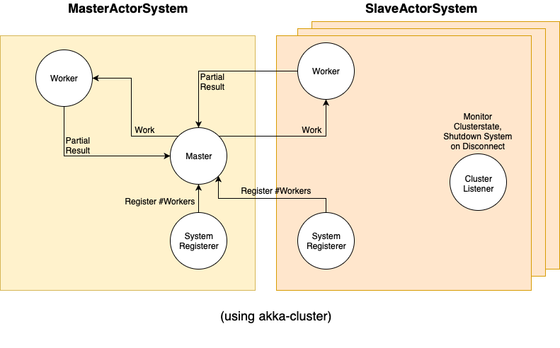

# ddm-handson-akka
Our solution for the akka hands-on of the Distributed Data Management course at the Hasso-Plattner-Institute.
We implement the task using `akka-cluster` as well as using plain akka. The [master branch](https://github.com/alpreu/ddm-handson-akka) is based on the [akka-cluster branch](https://github.com/alpreu/ddm-handson-akka/tree/akka-cluster), if you want to use the plain akka solution checkout the [akka-plain branch](https://github.com/alpreu/ddm-handson-akka/tree/akka-plain).

## Architecture

## Running the system
Build the project with maven first.  
To start the MasterActorSystem run:

`java -jar target/handson-akka-1.0-SNAPSHOT.jar master --workers <number of Worker actors> --slaves <number of SlaveActorSystems> --masterPort <MasterActorSystem port> --masterHost <MasterActorSystem address> --input students.csv `

The Master will now be waiting for the Slaves to connect.  
Start the SlaveActorSystems with:

`java -jar target/handson-akka-1.0-SNAPSHOT.jar slave --workers <number of Worker actors> --masterPort <MasterActorSystem port>  --masterHost <MasterActorSystem address> --slavePort <SlaveActorSystem port>`
